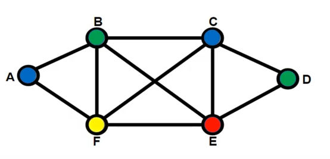

# Animação coloração de grafo

O objetivo da aplicação desenvolvida é simular o algoritmo de Coloração
Sequencial de Vértices de um Grafo utilizando a biblioteca gráfica OpenGL. Um
algoritmo de coloração de grafo não-dirigido funciona atribuindo uma cor ao
vértice de forma que cada vértice ligado a outro não possua a mesma cor, assim
dividindo o grafo utilizando da menor quantidade de cores possíveis. A figura a
seguir mostra um grafo não-dirigido e uma coloração válida com 4 cores.

<p align="center">

</p>

## Funcionalidades

- [x] Esferas 3D coloridas
- [x] Esferas animadas com rotação e escala
- [x] Esferas dispostas como um grafo
- [x] Arestas 3D
- [x] Arestas conectadas às esferas
- [x] Função câmera com controles
- [x] Animação com iluminação

## Execução

```bash
# Instalação das ferramentas necessárias
sudo apt install make g++ freeglut3 freeglut3-dev libglew libglew-dev libglm libglm-dev libglfw3 libglfw3-dev -y

# Compilar o projeto
make

# Executar
./colorGraph

# Limpar o projeto
make clean
```

## Recursos

https://www.youtube.com/playlist?list=PLVRDPs83ZhmcXYuktF3r2hfyoabg_EVPO

https://docs.gl
